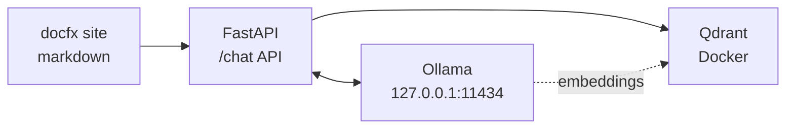

# docfx RAG

A documentation site powered by [docfx](https://dotnet.github.io/docfx/) with Retrieval-Augmented Generation (RAG) capabilities using **Qdrant** vector database and **Ollama** local LLM.

## Features

- **Static documentation site** generated by docfx from markdown files
- **Local RAG chatbot** that answers questions using your documentation as context
- **Qdrant vector database** running in Docker for fast similarity search
- **Ollama integration** for local embeddings (`nomic-embed-text`) and chat (`llama3`)
- **Header-based chunking** preserves document structure when indexing

## Architecture



## Prerequisites

- [.NET SDK](https://dotnet.microsoft.com/download) (for docfx)
- [Ollama](https://ollama.com/) running on `127.0.0.1:11434`
- [Docker](https://www.docker.com/) (for Qdrant)
- [pnpm](https://pnpm.io/) (package manager)

Pull required Ollama models:
```bash
ollama pull nomic-embed-text
ollama pull gemma:2b
```

## Scripts

| Script | Description |
|--------|-------------|
| `pnpm run dev` | Start docfx site and FastAPI chat server |
| `pnpm run rag:qdrant:up` | Start Qdrant Docker container |
| `pnpm run rag:qdrant:down` | Stop Qdrant Docker container |
| `pnpm run rag:index` | Index all markdown files into Qdrant |
| `pnpm run rag:setup` | One-command setup: start Qdrant + index docs |

## Quick Start

```bash
# Install dependencies
pnpm install

# Set up RAG (start Qdrant + index docs)
pnpm run rag:setup

# Start development server with chat API
pnpm run dev
```

The docfx site will be available at `http://localhost:8080` and the chat API at `http://127.0.0.1:8000`.

## How It Works

### 1. Indexing (`chat-api/index_docs.py`)
- Recursively finds all `.md` files in the project (excludes `_site/`, `qdrant_storage/`)
- Chunks documents by markdown headers (`#`, `##`, `###`)
- Generates embeddings using Ollama `nomic-embed-text` (768 dimensions)
- Stores vectors in Qdrant collection `docfx-docs`

### 2. Chat RAG (`chat-api/main.py`)
- User sends message to `/chat` endpoint
- Query is embedded using `nomic-embed-text`
- Qdrant performs similarity search (top 5 results)
- Retrieved context is injected as system prompt
- `llama3` generates answer based on documentation context

## Configuration

### Qdrant (docker-compose.yml)
- **REST API**: `http://localhost:6333`
- **gRPC**: `http://localhost:6334`
- **Storage**: `./qdrant_storage` (persistent volume)
- **Telemetry**: Disabled

### Chat API (chat-api/main.py)
- **Qdrant URL**: `http://localhost:6333`
- **Ollama URL**: `http://127.0.0.1:11434`
- **Embed Model**: `nomic-embed-text`
- **Chat Model**: `llama3`
- **Collection**: `docfx-docs`

## Project Structure

```
docfx-site/
├── chat-api/
│   ├── main.py           # FastAPI chat endpoint with RAG
│   ├── index_docs.py     # Markdown indexing script
│   └── requirements.txt  # Python dependencies
├── docs/                 # Documentation markdown files
│   ├── introduction.md
│   └── getting-started.md
├── docker-compose.yml    # Qdrant container definition
├── docfx.json           # docfx configuration
├── package.json         # pnpm scripts
└── index.md             # Site homepage
```

## API Endpoints

### POST `/chat`
Chat with your documentation using RAG.

**Request:**
```json
{
  "message": "How do I get started?"
}
```

**Response:**
```json
{
  "response": "Based on the documentation..."
}
```

### GET `/health`
Health check endpoint.

**Response:**
```json
{
  "status": "healthy"
}
```
