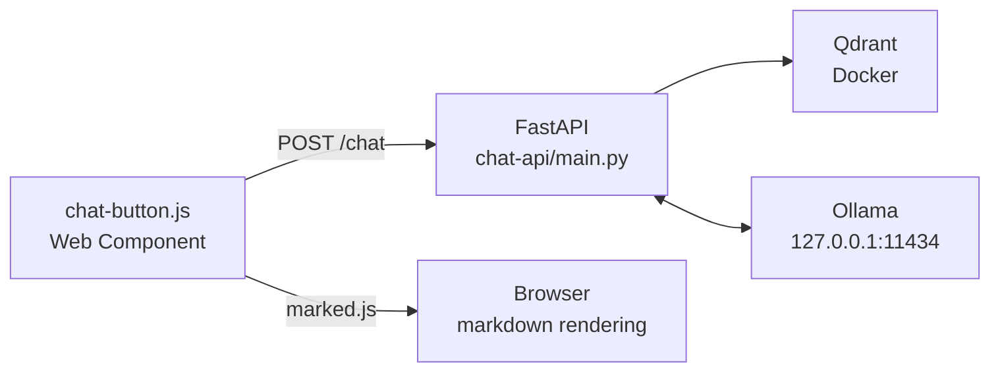

# Chat Window

**Part of Kiri Chat** — a floating, embeddable chat widget that lets users ask questions about the documentation using the RAG backend.

## What is this component?

The chat window is the user-facing interface of **Kiri Chat**. It's a web component (`<chat-button>`) that provides a floating chat button on every page, allowing users to ask natural language questions about the documentation and receive AI-generated answers with source attribution.

## Features

- **Web Component** (`<chat-button>`) — drop-in custom element, no framework required
- **Markdown rendering** — bot responses are rendered with `marked` for rich text, code blocks, and lists
- **Source attribution** — each response links back to the documentation sections used as context
- **Loading spinner** — animated indicator while the API processes the request
- **Auto-inject** — the chat button is automatically appended to `document.body` on page load

## Architecture



## Files

```
docfx-site/
├── chat-button.js       # Web Component (<chat-button>)
├── chat-api/
│   └── main.py         # FastAPI RAG backend (serves /chat)
└── docs/
    └── chat-window.md  # This documentation
```

## How It Works

### 1. Component Initialization
The `<chat-button>` custom element is defined in `chat-button.js`. On page load, a self-executing function checks for an existing `<chat-button>` and injects one if missing:

```javascript
(function() {
  function injectChatButton() {
    if (!document.querySelector('chat-button')) {
      const chatButton = document.createElement('chat-button');
      document.body.appendChild(chatButton);
    }
  }
  // ...
})();
```

### 2. User Interaction
1. User clicks the floating chat button (bottom-right corner)
2. Chat window opens with a message input and message history
3. User types a question and presses **Enter** or clicks **Send**
4. A loading spinner ("Thinking...") appears while the request is pending

### 3. API Request
The component sends a POST request to the chat API:

```javascript
const response = await fetch('http://localhost:8000/chat', {
  method: 'POST',
  headers: { 'Content-Type': 'application/json' },
  body: JSON.stringify({ message: text })
});
```

### 4. Response Rendering
- The bot's response (Markdown) is parsed with `marked` and inserted as HTML
- Source links are extracted from `data.sources` and rendered as clickable badges
- Each source link points to the exact documentation section used as context

## API Response Format

The chat API returns:

```json
{
  "response": "Based on the documentation...",
  "sources": [
    {
      "url": "http://localhost:8080/docs/getting-started.html#prerequisites",
      "header": "Prerequisites",
      "source": "docs/getting-started.md"
    }
  ]
}
```

## Styling

The component uses Shadow DOM for style encapsulation. Key CSS classes:

| Class | Purpose |
|-------|---------|
| `.chat-button` | Floating action button (60×60px circle) |
| `.chat-window` | Chat panel (350×500px, hidden by default) |
| `.chat-messages` | Scrollable message container |
| `.message.user` | User messages (blue, right-aligned) |
| `.message.bot` | Bot messages (white, left-aligned, Markdown-rendered) |
| `.message.loading` | Loading spinner container |
| `.spinner` | CSS-animated rotating circle |
| `.message-sources` | Source attribution section |
| `.sources-label` | "Sources:" label |

## Configuration

The chat button connects to the API at `http://localhost:8000/chat`. To change the endpoint, update the `fetch` call in `sendMessage()`:

```javascript
const response = await fetch('YOUR_API_URL/chat', {
  method: 'POST',
  headers: { 'Content-Type': 'application/json' },
  body: JSON.stringify({ message: text })
});
```

## Usage

### Automatic Injection (Default)
The chat button automatically appears on any page that loads `chat-button.js`:

```html
<script src="path/to/chat-button.js"></script>
```

### Manual Injection
To control placement, add the element directly in your HTML:

```html
<chat-button></chat-button>
<script src="path/to/chat-button.js"></script>
```

## Dependencies

| Dependency | Purpose | Loading |
|------------|---------|---------|
| `marked` (CDN) | Markdown-to-HTML rendering | Lazy-loaded on first message |
| FastAPI `/chat` | RAG backend endpoint | Required at runtime |
| Ollama | Local LLM for responses | Required at runtime |
| Qdrant | Vector search for context | Required at runtime |

## Notes

- The `marked` library is loaded on-demand (first message) to avoid blocking page load
- The chat window opens at 350×500px and floats above all other content (`z-index: 9999`)
- Source links open in a new tab (`target="_blank"`)
- The input field is automatically cleared after sending
- If the API is unreachable, an error message is displayed in the chat window
