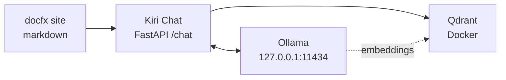

# Getting Started

Set up **Kiri Chat** — a RAG-powered chatbot that uses your documentation as a knowledge base, built with [docfx](https://dotnet.github.io/docfx/), **Qdrant** vector database, and **Ollama** local LLM.

## What is this project?

**Kiri Chat** is a RAG (Retrieval-Augmented Generation) system that transforms static markdown documentation into an interactive chat experience. Instead of traditional keyword search, users ask natural language questions and receive accurate, contextual answers sourced directly from the documentation.

This project uses docfx to generate the documentation site, but the core functionality is the chat system that lets users have conversations with an AI assistant that only answers based on your documentation content.

## Features

- **Static documentation site** generated by docfx from markdown files
- **Kiri Chat widget** — local RAG chatbot that answers questions using your documentation as context
- **Qdrant vector database** running in Docker for fast semantic search
- **Ollama integration** for local embeddings (`nomic-embed-text`) and chat (`gemma:2b`)
- **Header-based chunking** preserves document structure when indexing

## Architecture



## Prerequisites

- [.NET SDK](https://dotnet.microsoft.com/download) (for docfx)
- [Ollama](https://ollama.com/) running on `127.0.0.1:11434`
- [Docker](https://www.docker.com/) (for Qdrant)
- [pnpm](https://pnpm.io/) (package manager)

Pull required Ollama models:
```bash
ollama pull nomic-embed-text
ollama pull gemma:2b
```

## Scripts

| Script | Description |
|--------|-------------|
| `pnpm run dev` | Start docfx site and FastAPI chat server |
| `pnpm run rag:qdrant:up` | Start Qdrant Docker container |
| `pnpm run rag:qdrant:down` | Stop Qdrant Docker container |
| `pnpm run rag:index` | Index all markdown files into Qdrant |
| `pnpm run rag:setup` | One-command setup: start Qdrant + index docs |

## Quick Start

```bash
# Install dependencies
pnpm install

# Set up RAG (start Qdrant + index docs)
pnpm run rag:setup

# Start development server with chat API
pnpm run dev
```

The Kiri Chat docfx site will be available at `http://localhost:8080` and the chat API at `http://127.0.0.1:8000`.

## How It Works

### 1. Indexing (`chat-api/index_docs.py`)
- Recursively finds all `.md` files in the project (excludes `_site/`, `qdrant_storage/`)
- Chunks documents by markdown headers (`#`, `##`, `###`)
- Generates embeddings using Ollama `nomic-embed-text` (384 dimensions)
- Stores vectors in Qdrant collection `docfx-docs`

### 2. Kiri Chat RAG (`chat-api/main.py`)
- User sends message to `/chat` endpoint via the chat widget
- Query is embedded using `nomic-embed-text`
- Qdrant performs semantic + keyword search (top 5 results)
- Retrieved context is injected as system prompt
- `gemma:2b` generates answer based on documentation context
- Source links are returned for attribution

## Configuration

### Qdrant (docker-compose.yml)
- **REST API**: `http://localhost:6333`
- **gRPC**: `http://localhost:6334`
- **Storage**: `./qdrant_storage` (persistent volume)
- **Telemetry**: Disabled

### Kiri Chat API (chat-api/main.py)
- **Qdrant URL**: `http://localhost:6333`
- **Ollama URL**: `http://127.0.0.1:11434`
- **Embed Model**: `nomic-embed-text`
- **Chat Model**: `gemma:2b`
- **Collection**: `docfx-docs`

### Chat Widget (`chat-button.js`)
- **API Endpoint**: `http://localhost:8000/chat`
- **Auto-inject**: Enabled (appends to `document.body`)
- **Markdown rendering**: Lazy-loaded `marked.js` from CDN

## Project Structure

```
docfx-site/
├── chat-button.js       # Kiri Chat web component (<chat-button>)
├── chat-api/
│   ├── main.py           # Kiri Chat FastAPI RAG endpoint
│   ├── index_docs.py     # Markdown indexing script
│   └── requirements.txt  # Python dependencies
├── docs/                 # Documentation markdown files
│   ├── introduction.md   # Kiri Chat overview
│   ├── getting-started.md
│   └── chat-window.md    # Chat widget docs
├── docker-compose.yml    # Qdrant container definition
├── docfx.json           # docfx configuration
├── package.json         # pnpm scripts
└── index.md             # Kiri Chat homepage
```

## API Endpoints

### POST `/chat`
Chat with your documentation using RAG.

**Request:**
```json
{
  "message": "How do I get started?"
}
```

**Response:**
```json
{
  "response": "Based on the documentation..."
}
```

### GET `/health`
Health check endpoint.

**Response:**
```json
{
  "status": "healthy"
}
```
