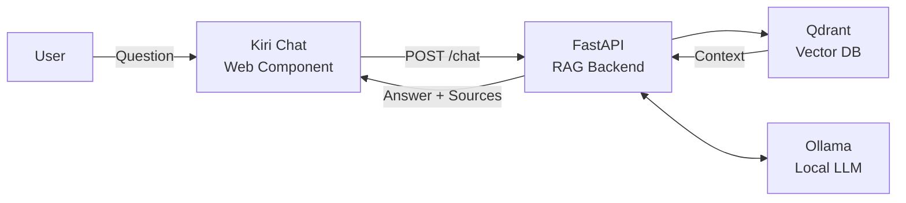

# Kiri Chat

**What is this project?** Kiri Chat is a RAG (Retrieval-Augmented Generation) system that transforms static documentation into an interactive chat experience.

## What is Kiri Chat?

Kiri Chat is a project that combines a documentation site generator (docfx) with AI-powered question answering. Instead of manually searching through documentation pages, users can ask questions in natural language and receive accurate, contextual answers.

**Key point:** This project is called **Kiri Chat** — a local, privacy-first documentation assistant.

Kiri Chat is a privacy-first, locally hosted chatbot that answers questions about your documentation using Retrieval-Augmented Generation. Ask natural language questions and get accurate answers grounded in your docs — with source links back to the exact sections used.

## Features

- **Semantic search** — understands the intent behind your questions, not just keywords
- **Local by design** — runs entirely on your machine with Ollama and Qdrant
- **Source attribution** — every answer includes links to the documentation sections used
- **Embeddable widget** — floating chat button (`<chat-button>`) for any page
- **Markdown-native** — responses preserve code blocks, lists, and formatting

## Architecture



## Quick Start

```bash
# Install dependencies
pnpm install

# Set up RAG (start Qdrant + index docs)
pnpm run rag:setup

# Start Kiri Chat (docfx site + chat API)
pnpm run dev
```

Then open `http://localhost:8080` and click the chat button in the bottom-right corner.

## Learn More

- [Introduction](docs/introduction.md) — what is Kiri Chat and why use it
- [Getting Started](docs/getting-started.md) — installation and setup
- [Chat Window](docs/chat-window.md) — embedding and customizing the chat widget